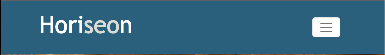

# horiseon-marketing

Rice University Bootcamp Code Refactoring challenege.

## Description

This week's challenge was an on-the-job ticket, which meant that I would receive starter code to edit and modify. The purpose behind this project was to assess what I have learned within my lessons so far and then apply them to the given code to make the landing page functional and the code as clean as I can.

The first aesthetic code I applied was to add an a:hover on the navigation bar. Hovering over the links adds a subtle change to the color of the text to match the color of the 'seo' in the Horiseon name on the navbar.

No hover:

```md

```

Hover:

```md
~[Nav Bar - Hover](assets/images/nav-hover.png)
```

The second thing I did was wrap the entire Navigation bar with a div and added a flex-box to it so that the links would stack nicely under the company name when the screen size was adjusted.

Mobile size:

```md

```

Within the CSS file of this project, I cleaned up the coding so that DRY code was eliminated.

I also added a "wrapper" flex-box div around both the marketing services section and the benefits section so that when the screen was adjusted it would descale cleanly.

```md

```

My most time consuming aspect that I experienced was figuring out flex-box correctly. Link under credits for the tutorial I followed.

## Installation

N/A

## Usage

N/A

## Credits

Flexbox tutorials -
Wes Bos: https://flexbox.io/
css-tricks: https://css-tricks.com/snippets/css/a-guide-to-flexbox/

## License

Please refer to the LICENSE in the repo.

```

```
